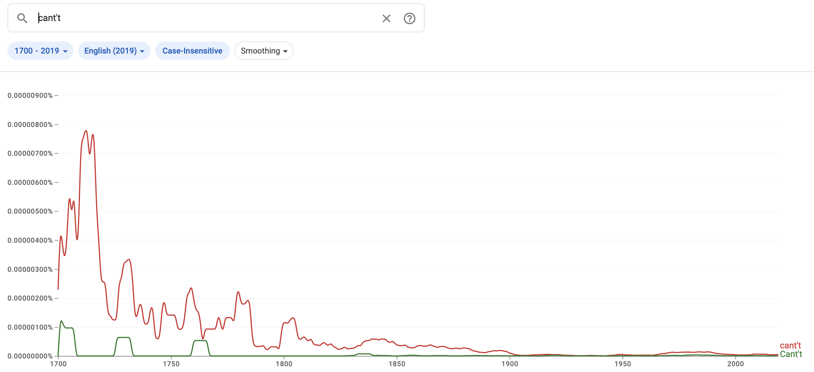
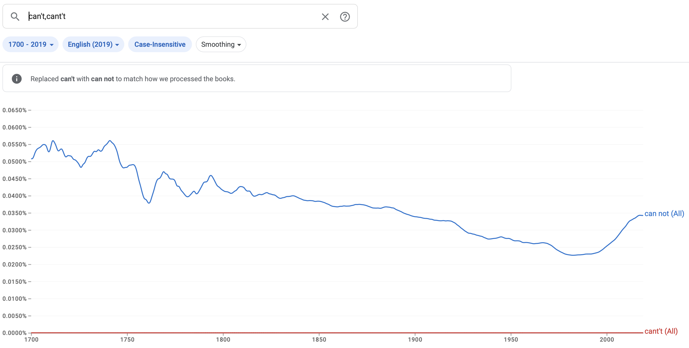

## The Whore: A Poem [1782] - 667eac014dacd ##

This is a [Distributed Proofreaders](http://www.pgdp.net/) post-processing project.

“The Whore: A Poem [1782]” by Unknown

* [DP project page](http://www.pgdp.net/c/project.php?id=projectID667eac014dacd)
* [Forum thread](https://www.pgdp.net/phpBB3/viewtopic.php?t=81922)
* [Good words](good_words.txt)
* [Bad words](bad_words.txt)
* [Project Gutenberg listing]() (not posted yet)

Page references (e.g. `001`) refer to the scan numbers, not the original book's page numbers.

### Things to revisit ###

* [x] This project uses `ſ` ("long s"); keep an eye out for mistakes.
* [x] PM specifically requested submission to SR
* [x] Need a cover: use 001
* [x] 005: illustrated drop-cap **in poetry** may need special handling
    * A helpful DP'er pointed to [Nonsense for old and young](https://www.gutenberg.org/ebooks/72827) for examples of how this can be done.
* [x] some gesperrt in the poem, decide how to handle
    * Italic text is used for emphasis too. Use an `em.gesperrt` class?
    * Decide how to handle gesperrt in the text version. Add spacing? Ignore?
    * Some are `<sc>` but some aren't, and not all `<sc>` are gesperrt.
    * Clearly it's used for emphasis. Italics also in use. In the text version use `=word=` and in HTML follow the [Gesperrt Emphasis case study](https://www.pgdp.net/wiki/DP_Official_Documentation:PP_and_PPV/DP_HTML_Best_Practices/Case_Studies/Inline_Formatting/Gesperrt_Emphasis).
* [x] Handle gesperrt in text version
* [x] Handle gesperrt in html version
* [x] Title page: names like `A——d` wrap mid-word, is there a way to control it?

### Project manager notes ###

#### About
__Author__:  "A Whore of Quality"  
__Source__: [The Internet Archive](https://archive.org/details/bim_eighteenth-century_the-whore-a-poem-writt_whore-of-quality_1782/mode/2up)

A scathing poem about society's hypocrisy regarding sexual mores, and the cruelty with which women and girls were treated. 

#### Proofing
Difficulty:  Average  
Please follow the usual [proofreading guidelines](https://www.pgdp.net/wiki/DP_Official_Documentation:Proofreading/Proofreading_Guidelines).  
Use of Word Check is recommended in P1, and required in P2 & P3.

Please change any [long s (ſ)](https://www.pgdp.net/wiki/DP_Official_Documentation:Proofreading/Proofing_old_texts#Long_s) you come across to a normal letter s.

#### Formatting
Difficulty: Average   
Please follow the usual [formatting guidelines](https://www.pgdp.net/wiki/DP_Official_Documentation:Formatting/Formatting_Guidelines).  

#### Post-Processing
Please submit this project to the Smooth Reading Pool.  
*If you would like to volunteer to PP this book, please send me a PM.*

#### Notes
If you have any questions about this project, please ask in the forum thread.

***Thank you for working on this project!***

### Forum notes ###

> All of the small caps in this volume are also printed as gesperrt.
> Should we mark them as both?

PM responds: no, only small-caps.

### General notes ###

### Illustrations ###

* [x] 005: top-of-page decoration
* [x] 005: illustrated drop-cap
* [x] 023: end of book decoration

### Proofer's notes ###

007: `If he cant't[**typo in original text] eat,`

Expanding Ngrams search range to begin in 1700, there's a surprising graph that suggests this usage may have been valid throughout the 18th century and tapered off in the 19th to vanish by the beginning of the 20th... but comparing with `can't` over the same period, it seems to have been a possibly common printer error? In that graph it drops to be flat.





008: `mourn'd my hapless fate;[** , ?]`

Reviewing the spacing after a word, before `,` and `;`, this appears to be `,`.

### Joined hyphenated words ###

### Spellcheck ###

### Transcriber's notes ###

```
Some inconsistencies in spelling, hyphenation, and punctuation have been
retained.

[text]
This file uses _underscores_ to indicate italic text and =equals= to indicate
gesperrt text (which was  s p a c e d   o u t  for emphasis in the original).

[html]
Some typographic conventions have been normalized, e.g., the use of small
capitals to begin each stanza.

p. 7: changed cant’t to can’t (If he can’t eat)
p. 9: changed tanght to taught (lessons you’d been taught)
p. 14: changed Goals to Gaols (Whips, Gaols, Diseases!)
```

### Ebook review ###

### Smooth Reading ###

One SR mentions Moon+ on Android doesn't render the illustrated drop-cap correctly. Investigating further, the problem seems to be that Moon+ is *trying* to render it, instead of ignoring it and using the `x-ebookmaker` CSS overrides like it should. Gave some feedback and notes to SR to follow up with Moon+ support, but Moon+ doesn't seem to be interested in fixing (or else they don't understand the description of the problem.)

```
Is it an empty name, and nought but found[** "sound" in scan (long-s scanno) ]?
```

Corrected to `sound` (good catch!)

```
Whips, Goals[** possible typo for "Gaols" (matches scan as-is) ], Diseases! all the WHORE assail,
```

Corrected to `Gaols` (second good catch!)

Two SRs found no issues. A fourth noted some potential issues but none of them seemed correct to me, left those as-is.
